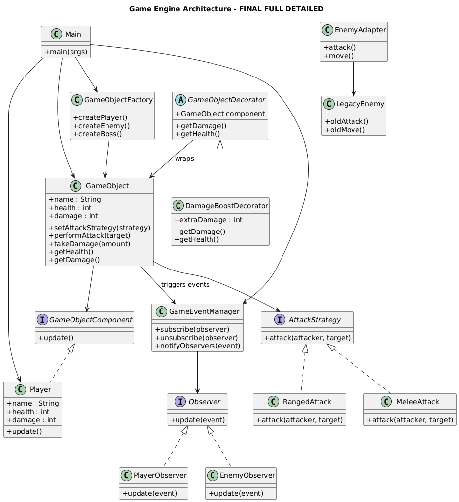

# 🎮 Game Engine Refactoring Project

##  Proje Açıklaması
Bu proje, nesne yönelimli programlama (OOP) prensipleri ve tasarım desenleri kullanılarak geliştirilmiş basit bir oyun motoru mimarisidir.

Amaç, sistemi daha **esnek, genişletilebilir ve bakımı kolay** hale getirmek ve farklı tasarım desenlerini gerçek bir senaryo üzerinde uygulamaktır.

Proje üç fazdan oluşmaktadır:
- Phase 1: Creational Patterns  
- Phase 2: Structural Patterns  
- Phase 3: Behavioral Patterns  

---

#  Kullanılan Tasarım Örüntüleri

---

##  Phase 2 - Structural Patterns

###  Decorator Pattern
## Dosyalar:

GameObjectDecorator.java
DamageBoostDecorator.java

GameObject nesnelerine runtime sırasında yeni özellikler eklemek için kullanılmıştır.

✔ Mevcut sınıfı değiştirmeden yeni özellik eklenebilir  
✔ Örnek: `DamageBoostDecorator` ile saldırı gücü artırma  

---

###  Adapter Pattern
## Dosyalar:

LegacyEnemy.java
EnemyAdapter.java

LegacyEnemy sınıfını mevcut oyun motoruna uyumlu hale getirmek için kullanılmıştır.

✔ Eski kod değiştirilmeden sisteme entegrasyon sağlanır  
✔ Sistem genişletilebilir hale getirilir  

---

##  Phase 3 - Behavioral Patterns

###  Observer Pattern
## Dosyalar:

Observer.java
PlayerObserver.java
EnemyObserver.java
GameEventManager.java

GameObject üzerindeki değişikliklerin (örneğin health değişimi veya event’ler) diğer sistemlere otomatik bildirilmesini sağlar.

✔ Event-driven mimari sağlar  
✔ Loose coupling oluşturur  
✔ Örnek: PlayerObserver, EnemyObserver  

---

###  Strategy Pattern
## Dosyalar:

AttackStrategy.java
MeleeAttack.java
RangedAttack.java

Saldırı algoritmalarının runtime sırasında değiştirilebilmesini sağlar.

✔ Farklı saldırı davranışları desteklenir  
✔ Örnek: MeleeAttack, RangedAttack  
✔ Open/Closed Principle (OCP) uygulanır  

---

##  OCP (Open/Closed Principle)
Sistem, mevcut kodu değiştirmeden yeni davranışlar eklenebilecek şekilde tasarlanmıştır.

✔ Yeni observer eklemek mümkündür  
✔ Yeni attack strategy eklemek mümkündür  
✔ Mevcut kod yapısı bozulmaz  

---
## Nasıl Çalıştırılır

 ## Gereksinimler
Java JDK 8 veya üzeri
Git
IDE (VS Code / IntelliJ / Eclipse)

## Çalıştırma Adımları

1-  Projeyi indir
git clone https://github.com/AleynaBengisuPinarli/mini-game-engine-patterns.git

2-  Proje klasörüne gir
cd mini-game-engine-patterns

3- Phase-3 branch’ine geç
git checkout phase-3

4- Compile et
javac src/*.java

5- Çalıştır
java src/Main

## 🏗 Mimari Diyagram

Aşağıdaki diyagram sistem mimarisini göstermektedir:

